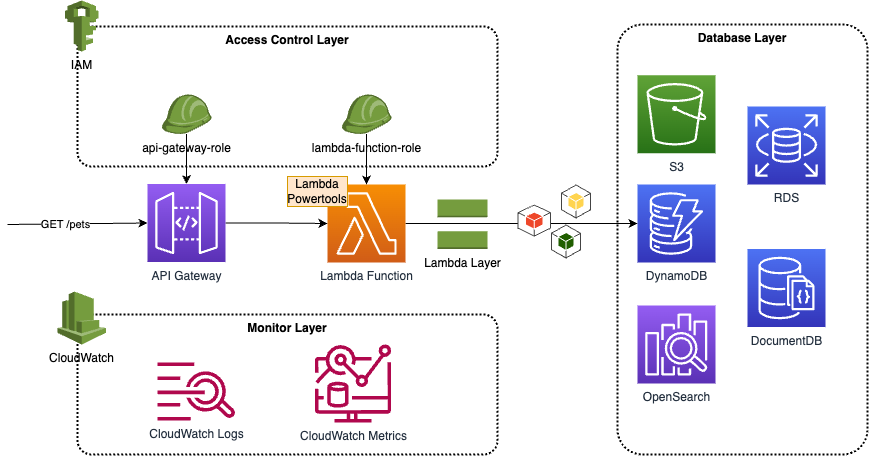

# A REST API (Serverless) in AWS using Terraform

The project is a AWS cloud native serverless application partially, including API Gateway, Lambda function (with layers), and RDS database for data persistence. _Partially_ here means we use RDS database as data layer for demo purpose instead of a _serverless_ database, like DynamoDB. However, AWS provides a variety of storage services and you should make the decisition as you needs.

The diagram below shows the archtecture details. All AWS resources are built and deployed using Terraform.



## Code Structure

The project structure shows as below. It contains threee parts:
- _terraform_ folder: all terraform resources and configurations. _deployment_ contains three componets:
  - _common_infra_: we defines all common infrastructure resources here, such as IAM roles and policies that referenced in other components. Resources that is depended by other resources should be deployed with high priority. In other word, _**Most Dependent first**_.
  - _frontend_: the core of project, including API Gateway, Lambda Function, CloudWatch Logs, etc.
  - _lambda_layers_: the Lambda Layers. We define Lambda Layers into a separated component because we put lambda dependencies here which is rarely modified. The benefits are not only a lightweighted Lambda deployment package, but also a distribution mechanism for libraries, custom runtimes, and other function dependencies.
- _src_ folder: all Lambda functions and layers code goes here.
- _tests_: for a standard project, test specs are necessary.
- _scripts_: I put all shell scripts here, including running terraform commands locally or in CICD pipelines.

> Note: we don't provide the terraform definition for database layer as we only focus on a quick start to guide you how to setup a Serverless based REST API in AWS using Terraform. You should be good to create a specific component in _terraform/deployment_ folder to define your storage service, for example, a DynamodDB table as you needs.

```bash
# tree -L 2 -all
.
├── .pre-commit-config.yaml     # configuration for pre-commit, such as lint, auto format, test
├── Jenkinsfile                 # Jenkins pipeline to deploy a specific component
├── Jenkinsfile.ci              # Jenkins pipeline to deploy all components in order
├── Makefile                    # A makefile to simplify your local deployment using shell scripts
├── Pipfile                     # A configuration for the project top-level requirements
├── Pipfile.lock
├── README.md
├── pylintrc                    # configuration for pylint
├── pytest.ini                  # configuration for pytest
├── scripts                     # shell scripts for makefile and Jenkins pipelines
├── src                         # lambda functions, layers, dependencies source code
│   ├── frontend
│   └── lambda_layers
├── swagger
│   ├── spec.yaml               # swagger specification
│   ├── index.html
├── terraform                   # terraform components and modules definition
│   ├── deployment
│   ├── modules
│   └── settings
└── tests                       # test files and cases, postman collection, unit test, E2E test, etc
    ├── data
    └── postman
    └── unit
    └── e2e
```
## Deploy Terraform Resources

### Local Environment Setup

Find the details from [Local Environment Setup](./docs/local-setup.md)

### Local Deploy

Run below `make` command to deploy specific component.

```bash
# deploy common_infra
make deploy.infra
# deploy lambda_layers
make deploy.layers
# deploy frontend
make deploy.frontend

# useful when there is no change on external denpendencies in requirements-external.txt
make deploy.layers.quick
```

If you have any change on _lambda_layers_, make sure to deploy lambdas as well to use the latest version of layers.

It will spend a few minutes to install terraform providers when you run it firstly. With the scrips run successfully, verify the change from AWS Console.

### Local Destroy

Run below comnand to destroy/remove components from AWS.

As `frontend` depends on `lambda_layers`, you cannot destroy component before destorying its dependencies.

```bash
# deploy common_infra
make destroy.infra
# destroy lambda_layers
make destroy.layers
# destroy frontend
make destroy.frontend

# destroy all resources from AWS in order
make destroy.all
```

### CICD Pipelines
We use GitHub Actions for CICD.

Find more information from [CICD Setup](./docs/cicd.md)


## Development
A entry file named `local_invoke.py` that is used to execute the lambda source code locally.

Below is a test case input that get pet by pet id 1.

```bash
python local_invoke.py tests/data/get_pet_by_id.json

# Input:
#   {
#       "resource": "/pets/{petId}",
#       "path": "/pets/1",
#       "httpMethod": "GET",
#       "pathParameters": {
#           "petId": "1"
#       }
#   }

# Output:
#   {
#     "code": "200",
#     "message": "success",
#     "data": {
#       "pets": {
#         "id": 1,
#         "type": "dog",
#         "price": 249.99
#       }
#     },
#     "path": "/pets/1",
#     "traceId": null,
#     "timestamp": 1690860006
#   }
```
## Test
For a standard project, you should have test specification setup, such as unit test, e2e test, etc. And `Postman` is a popular tool for local development.
### Postman

Find Postman colllection from [collection.json](./tests/postman/collection.json)

Please keep Postman colllection updated.

### Unit Test

```bash
# Run all unit test cases in /tests/unit folder
make test.unit

# Run unit test cases in a sepcific file
python -m pytest ./tests/unit/test_main.py
```

### E2E Test

```bash
# Run all e2e test cases in /tests/unit folder
make test.unit

# Run e2e test cases in a sepcific file
python -m pytest ./tests/e2e/test_pets.py
```

Run all test cases using command `make test`.

## Linting
Pylint is a static code analyser for Python 2 or 3.

Pylint analyses your code without actually running it. It checks for errors, enforces a coding standard, looks for code smells, and can make suggestions about how the code could be refactored.

> To keep code quality, passing lint is mandantry to commit your code using pre-commit.

See https://pypi.org/project/pylint/ for more information.

## Pre Commit
A framework for managing and maintaining multi-language pre-commit hooks.

Git hook scripts are useful for identifying simple issues before submission to code review. We run our hooks on every commit to automatically point out issues in code such as missing semicolons, trailing whitespace, and debug statements. By pointing these issues out before code review, this allows a code reviewer to focus on the architecture of a change while not wasting time with trivial style nitpicks.

Each time you commit your code on local, these hooks will be triggered to validate as configured. Except for some pre-commit provided hooks, we also add another hook named `pylint` to make sure your code follow and pass all rules defined in _pylintrc_ file. You can run `make lint` at any time to check the code lint result.

> Please note, `make lint` command checks both static code as well as rewrite terrafrom configuration files to a canonical format and style.

Below hooks are enabled in configuration `.pre-commit-config.yaml`.
- trailing-whitespace
- check-yaml
- lint
- pytest-check

See https://pre-commit.com/ for more information.

## Reference

- https://registry.terraform.io/providers/hashicorp/aws/latest
- https://pipenv.pypa.io/en/latest/
- https://docs.aws.amazon.com/cli/latest/userguide/cli-configure-files.html
- [Install Terraform](https://developer.hashicorp.com/terraform/tutorials/aws-get-started/install-cli)
- [AWS Lambda Powertools for Python](https://awslabs.github.io/aws-lambda-powertools-python/2.12.0/)
- https://docs.aws.amazon.com/lambda/latest/dg/gettingstarted-package.html#gettingstarted-package-layers
- https://github.com/awslabs/aws-lambda-powertools-python